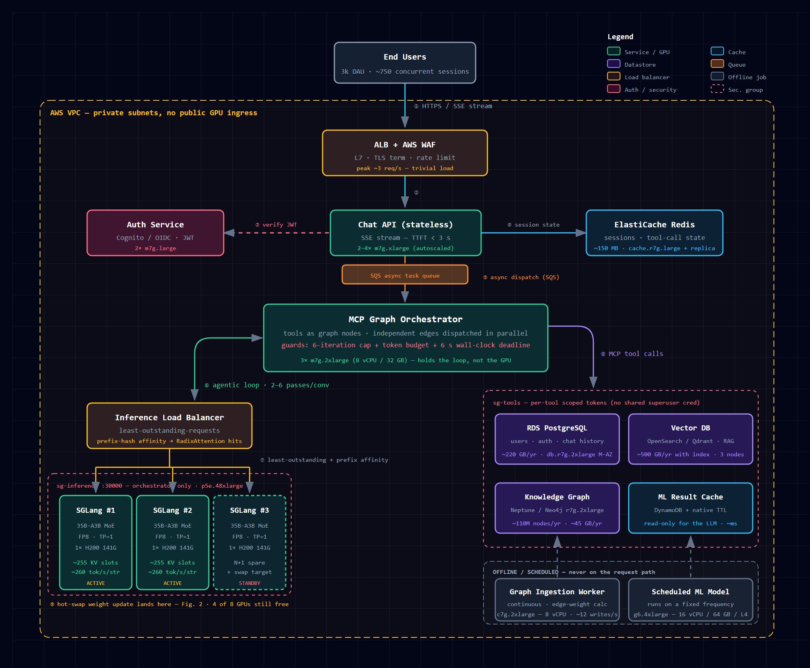
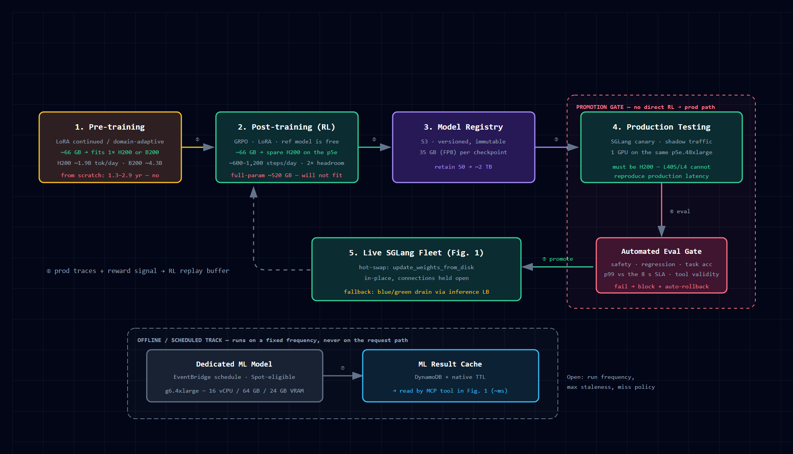

# sys-estimation

System requirements, architecture, and AWS cost estimation for a self-hosted **Qwen/Qwen3.6-35B-A3B** LLM platform — SGLang serving, a graph-based MCP harness, a continuously-ingested knowledge graph, and a continuous RL pipeline with gated hot-swap deployment.

## Contents

| File | What it is |
|---|---|
| [PLATFORM_REPORT.md](PLATFORM_REPORT.md) | **Start here.** Client-facing report: sizing, latency budget, full AWS cost breakdown, build-vs-buy analysis, risks, recommendations. |
| [SYSTEM_REQUIREMENTS.md](SYSTEM_REQUIREMENTS.md) | Engineering detail — load model, GPU sizing derivation, subsystem specs, single-GPU training assessment. |
| [deployment-architecture.md](deployment-architecture.md) | Architecture diagrams — rendered images plus the Mermaid source. |
| [deployment-architecture.html](deployment-architecture.html) | Same diagrams as self-contained inline SVG, with PNG/PDF export buttons. Open locally. |
| [deployment-architecture-artifact.html](deployment-architecture-artifact.html) | Publish-safe copy — no CDN dependencies, no export toolbar. |
| [images/](images/) | Rendered figures — PNG for viewing, SVG for vector/print. Generated from `deployment-architecture.html`. |

## Architecture

### Fig. 1 — Live production request path

Two active SGLang replicas plus one standby, each a single H200 141 GB at FP8/TP=1, behind a least-outstanding-requests load balancer with prefix-hash affinity. The orchestrator holds the agentic loop; the GPUs only decode.

### Fig. 2 — Training, gated hot-swap, and the scheduled ML track

RL and continued pre-training run on the spare H200s of the same instance. Nothing reaches live traffic without clearing the eval gate — including a p99 latency check against the 8-second SLA.

## Design target

| Parameter | Value |
|---|---|
| Model | Qwen/Qwen3.6-35B-A3B (MoE — 35B total, ~3B active) |
| Serving | SGLang, FP8, TP=1 |
| Daily active users | 3,000 |
| Conversations per day | 30,000 (10 per user) |
| Tokens per conversation | 5,000 |
| Agentic passes per conversation | 2–3 typical, 6 hard cap |
| Peak concurrent sessions | ~750 |
| Response time SLA | 2–8 seconds |
| Cloud | AWS |

## Headline conclusions

- **The whole platform fits on one `p5e.48xlarge`** (8× H200 141 GB), with all 8 GPUs allocated: 2 live serving, 1 standby, 1 canary, 4 training.
- **$311,089/year** on a 3-year reserved commitment — **$0.0284 per conversation**, **$8.64 per user per month**. On-demand is $626,029/year, so the 3-year commit is worth ~57%.
- **H200 over H100 costs ~15% more and buys the SLA back.** 141 GB HBM3e at 4.8 TB/s vs 80 GB at 3.35 TB/s → ~1.43× decode, ~4.6 s end-to-end instead of ~6.4 s, and ~255 KV slots per replica instead of ~96. On a 3-year commit the delta is **$31,247/year** — see §10.2 of the report.
- **A3B is Mixture-of-Experts, and that halves the fleet.** VRAM is sized by total parameters, compute and bandwidth by active parameters — so decode runs ~4–5× faster than a dense 35B and each replica fits on one GPU instead of two.
- **Concurrent sessions are not GPU streams.** By Little's Law only ~25 sessions are generating at peak, out of ~750 open. Sizing GPUs against the session count would over-provision by an order of magnitude.
- **Latency sets the replica count, not throughput.** One replica clears peak tokens/second, and on H200 one replica now also meets the 8-second ceiling (~6.7 s) — so the second active replica buys margin rather than compliance.
- **The 6-iteration cap no longer breaches the SLA on H200** (~7.0 s, down from ~9.6 s on H100) — but ~1 s of margin is not a guarantee. A wall-clock deadline is still required; an iteration cap does not bound latency.
- **The client's "1× H200" training requirement is satisfied by a spare GPU on the serving instance** — no separate training machine. LoRA training fits on one GPU; full-parameter RL does not (~66 GB vs ~520 GB — AdamW FP32 optimizer state alone is 280 GB). Pre-training a base model from scratch would take ~2.9 years on a single GPU and is not feasible.
- **Self-hosting is ~4.3× more expensive than a commercial API at this volume.** It is justified by the RL loop, data residency, and latency ownership — not by cost. Break-even is around 129,000 conversations/day.

## Status

Directional back-of-the-envelope estimates, sufficient to scope a purchase order. Every assumption is listed in Appendix A of the report. **Benchmark the real model on a single H200 and measure p99 against the 8-second ceiling before procurement.** AWS pricing verified August 2026 for `us-east-1`; re-confirm in the AWS Pricing Calculator on the day of purchase.

> **One pricing caveat.** The `p5e.48xlarge` on-demand rate ($63.296/hr) is from published sources. The **3-year reserved rate ($27.344/hr) is derived** by applying `p5`'s verified reserved discount (43.2% of on-demand) to `p5e`, because AWS does not publish a p5e reserved rate openly. **Confirm it with AWS before committing** — it is the single largest line in the budget.
