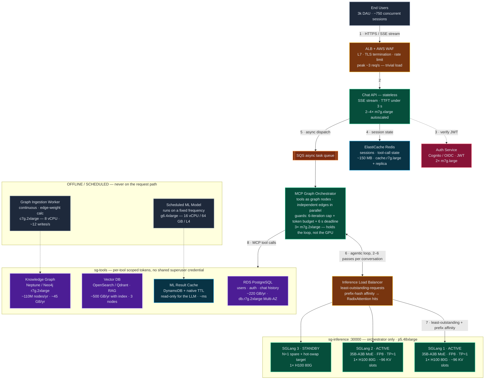
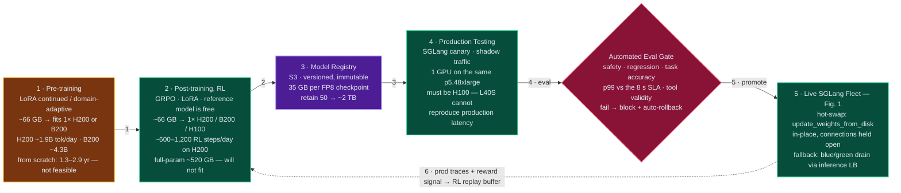
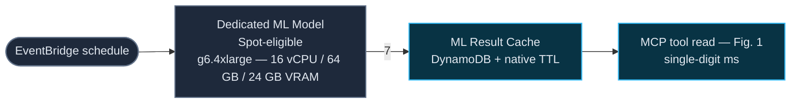

# Qwen3.6-35B-A3B Platform — AWS Deployment Architecture

SGLang · graph MCP harness · continuous RL hot-swap — 3k DAU / ~750 concurrent / 30k conversations per day / 2–8 s response SLA

> **A3B = Mixture-of-Experts: 35B total parameters, ~3B active per token.**
> VRAM is sized by total params (~35 GB at FP8) but compute and memory bandwidth by active params — so decode runs ~4–5× faster than a dense 35B and each replica fits on **one** H100 at TP=1.
> Live fleet drops from 6× H100 to **3× H100**. Replica count is set by the **latency SLA, not throughput**.

*Markdown version of `deployment-architecture.html`, which carries the same figures as inline SVG with PNG/PDF export.*
*Full AWS cost breakdown in `PLATFORM_REPORT.md`; engineering detail in `SYSTEM_REQUIREMENTS.md`.*

---

## Fig. 1 — Live production request path (AWS)

All components sit in an **AWS VPC on private subnets, with no public GPU ingress**. Dashed groups below are security-group boundaries.

### Flow

| # | Step | Notes |
|---|---|---|
| 1 | Users → ALB | HTTPS, SSE streaming back |
| 2 | ALB → Chat API | ~3 req/s peak — trivial for the web tier |
| 3 | Chat API → Auth | JWT verification |
| 4 | Chat API → Redis | Session and tool-call state |
| 5 | Chat API → SQS → Orchestrator | Decouples long agentic runs from the HTTP tier |
| 6 | **Orchestrator ↔ Inference LB** | **The agentic loop — traversed 2–6 times per conversation** |
| 7 | Inference LB → SGLang pool | Least-outstanding-requests + prefix-hash affinity |
| 8 | Orchestrator → MCP tool servers | Per-tool scoped tokens |
| 9 | Hot-swap weight update → SGLang pool | See Fig. 2. Four of the eight GPUs remain free. |

### Component specifications

| Component | Instance / service | Sizing basis |
|---|---|---|
| Edge load balancer | ALB + AWS WAF | TLS, rate limiting; ~3 req/s peak |
| Auth service | Cognito, or 2× `m7g.large` | OIDC / OAuth2, JWT + refresh |
| Chat API | 2–4× `m7g.xlarge` | Stateless, SSE, autoscaled |
| MCP Graph Orchestrator | 3× `m7g.2xlarge` (8 vCPU / 32 GB) | CPU-bound routing; holds the loop, not the GPU |
| Async queue | SQS | 75k messages/day |
| Session cache | ElastiCache `cache.r7g.large` + replica | 750 sessions × ~200 KB ≈ 150 MB |
| **SGLang pool** | **3× H100 80 GB on one `p5.48xlarge`** | **2 active + 1 standby, FP8, TP=1** |
| Inference LB | Least-outstanding + prefix hash | Load-bearing, not an optimisation |
| Chat history / auth | RDS `db.r7g.2xlarge` Multi-AZ, 1 TB gp3 | ~220 GB/yr, ~5 QPS — no sharding |
| Vector DB | OpenSearch Serverless, or 3× `r7g.xlarge` | ~500 GB/yr with index overhead |
| Knowledge graph | Neptune `db.r6g.2xlarge`, or Neo4j on `r7g.2xlarge` | ~110 M nodes/yr, ~45 GB/yr |
| Graph ingestion worker | `c7g.2xlarge` (8 vCPU) | Edge-weight calculation, ~12 writes/s |
| ML result cache | DynamoDB + native TTL | Read-only for the LLM |
| Scheduled ML model | `g6.4xlarge` (16 vCPU / 64 GB / L4) | Fixed-frequency job, EventBridge-triggered |

---

## Fig. 2 — Training, gated hot-swap, and the scheduled ML track

> **Promotion gate — there is no direct RL → production path.** Every checkpoint clears the automated eval suite before it reaches live traffic. A continuous training pipeline that can push straight to production is a continuous outage pipeline.

### Offline / scheduled track

Runs on a fixed frequency and is **never on the request path**.

**Open on this track:** run frequency, maximum acceptable staleness, and cache-miss policy — serve stale, trigger an on-demand run, or return unavailable. The last is usually correct for a latency-bound system.

---

## MoE halves the fleet

- VRAM by **total** params: ~35 GB at FP8 → fits **1× H100, TP=1**
- Bandwidth by **active** params: 3 GB per token, not 35
- Decode **~4–5× faster** than a dense 35B — ~200 tok/s single-stream
- KV ~48 KB/token → **~96 slots** per replica at 8K context
- **BF16 would not fit** (70 GB weights leaves ~2 GB for KV) — FP8 is required for TP=1

## Latency sets the replica count

- Throughput needs **1 replica**; the 8-second SLA needs **2**
- 1 replica → batch 25 → 120 tok/s per stream → **~8.5 s, breaches**
- 2 replicas → batch 12 → 180 tok/s per stream → **~6.4 s, meets**
- **The 6-iteration cap breaches 8 s** (~9.6 s) — this needs a wall-clock deadline, not just an iteration cap
- SSE streaming brings TTFT to ~2.6 s — the highest-leverage fix

## Sizing basis

- 30k conversations/day × 2.5 passes = **75k inference calls/day**
- Decode **30 M tokens/day** → ~1,200 tok/s peak
- Prefill 306 M uncached → **~150 M with prefix cache**
- Little's Law: **~25 streams generating**, not 750 — the session count never drove GPU sizing
- Prefix affinity at the inference LB is **load-bearing**, not an optimisation

## AWS footprint

- **1× `p5.48xlarge`** carries live (3 GPUs) + canary (1 GPU), 4 spare for training
- Price against **Capacity Blocks / Savings Plans** — on-demand p5 is the worst rate
- `g6.4xlarge` for the scheduled ML model — an exact match to the stated spec
- `c7g.2xlarge` is the 8 vCPU graph weight worker
- Data tier is small: ~220 GB/yr Postgres, ~500 GB/yr vector, ~45 GB/yr graph

## Training on one GPU — verdict

- **LoRA RL fits: ~66 GB** on 1× H200 (141 GB) or B200 (180 GB). ~600–1,200 steps/day
- **Full-parameter RL does not: ~520 GB.** AdamW FP32 state alone is 280 GB
- With LoRA the KL **reference model is free** — base weights, adapters disabled
- LoRA continued pre-training viable: **~1.9 B tok/day on H200, ~4.3 B on B200**
- **From-scratch pre-training: 1.3–2.9 years on one GPU.** Not feasible

## Open risks

- **AWS sells no single H200 or B200** — both are 8-GPU SKUs. Use the **4 spare H100s on the `p5` already in the plan** rather than buying another instance
- Training and serving would then share a machine — pin GPUs so a training job cannot breach the 8 s SLA
- Graph weight calculation: 8 vCPU is fine **incrementally**, not for global PageRank over 110 M nodes
- Continuous graph ingestion needs a **retention / decay policy** from day one
- **`p5e` (H200) is worth pricing for serving too** — ~1.43× decode, ~5.2 s end-to-end

---

*Qwen/Qwen3.6-35B-A3B on SGLang · graph MCP harness · AWS · continuous RL with gated hot-swap.*
*Directional estimates. Benchmark the real model on a single H100 and measure p99 against the 8-second ceiling before procurement.*
*Full cost breakdown in `PLATFORM_REPORT.md` — $279,842/yr on a 3-year reserved `p5.48xlarge`, or $0.0256 per conversation.*
